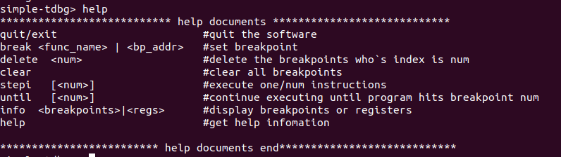

# simple-gdb
This is a very simple gdb toy.

## Introduction
这个项目是对 [](https://github.com/OrangeGzY/tiny_debugger) 项目的扩展实现，主要原理是使用ptrace系统调用实现目标进程的跟踪，断点注入，查看内存与寄存器信息等。
目前实现的功能有以下：
- break，断点；
- stepi、until、run，步进执行；
- info，显示相关信息
- clear，清除断点
- 历史命令回溯；

> 
> 

## Usage
```
make

./simple-tdbg [被追踪的程序]
```

## Waring
由于这个玩具gdb目前支持EXEC格式的ELF可执行文件，并不支持DYN和REL格式文件，因此在使用GCC生成被追踪的目标文件时，应该加上 -no-pie 选项。例如：
```shell
gcc -no-pie tracee.c -o tracee
```
